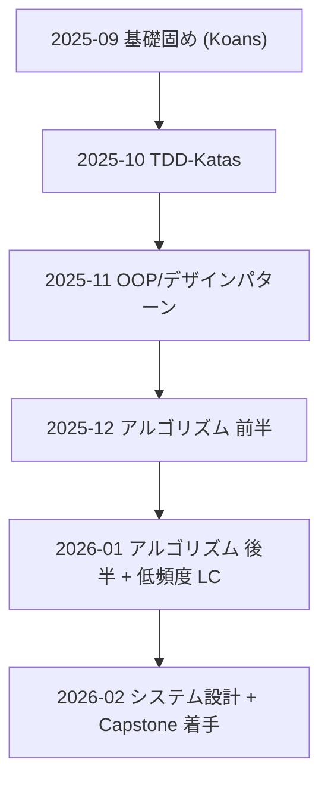

# 月次ロードマップ（2025-09 → 2026-02）



## 方針（毎日 30 分・やりすぎない）

- 1 日 1 ファイル（または 1 問）だけに限定して確実に「赤 → 緑 →2 行メモ」
- テスト先行（pytest → 落ちる → 最小修正 → 緑）
- メモは `docs/koan_notes.md` 等に 2 行だけ（何が分かったか / どこで詰まったか）

## 毎朝のルーチン（固定）

```text
1. git pull --rebase
2. pytest -q          # 妥当性確認
3. 今日の目標を Issue に 1 行で追記
4. 25 分実装（Pomodoro）
5. 学びを 2 行メモ → commit → push
```

## 初回セットアップ（PowerShell / Windows）

```powershell
# 作業ディレクトリ
mkdir -p $HOME\code\roadmap; cd $HOME\code\roadmap

# 学習用リポジトリ
git clone https://github.com/gregmalcolm/python_koans.git
git clone https://github.com/faif/python-patterns.git
git clone https://github.com/TheAlgorithms/Python.git thealgorithms-python
git clone https://github.com/donnemartin/system-design-primer.git

# Python 3.12 仮想環境
py -3.12 -m venv .venv
.\.venv\Scripts\Activate
pip install -U pip
pip install pytest pytest-cov pytest-benchmark black isort pre-commit

# 動作確認（Koans 最初の 1 件だけ）
cd python_koans; pytest python_koans/about_asserts.py -x; cd ..
```

---

## 2025-09（Week 1-4）：Koans で基礎固め

- 月ゴール（受入基準）
  - `python_koans` の基礎 10 ファイルを「赤 → 緑」完走
  - 各ファイルにつき 2 行メモを残す（合計 20 行以上）
- 週ごとの目安
  - W1: about_asserts, about_none, about_strings
  - W2: about_lists, about_tuples, about_dictionaries
  - W3: about_control_statements, about_methods
  - W4: about_classes, about_inheritance（無理なら 1 つで OK）
- コマンド例
  - `pytest python_koans/about_strings.py -x`
  - 緑化後 `git commit -m "Koans: strings green"`

## 2025-10（Week 5-8）：TDD-Katas（Bowling など）

- 月ゴール（受入基準）
  - 代表 3 Katas を TDD で完走（Bowling / FizzBuzz / Roman Numerals）
  - GitHub Actions（pytest + black --check）を導入
- 週ごとの目安
  - W5: FizzBuzz（RED→GREEN→REFACTOR の型を体得）
  - W6: Bowling（分割統治・テスト粒度を調整）
  - W7: Roman Numerals（境界値テスト）
  - W8: CI 導入 + README に学び TOP3 追記
- コマンド例
  - `pytest --maxfail=1 -q` / `pytest --cov`

## 2025-11（Week 9-12）：OOP / デザインパターン

- 月ゴール（受入基準）
  - 主要 8 パターンを実装 + pytest で振る舞い検証
  - before/after 差分レビューコメントを 8 件残す
- 週ごとの目安
  - W9: Strategy / Observer
  - W10: Factory / Singleton（アンチパターンも理解）
  - W11: Decorator / Adapter
  - W12: Command / Template Method（8 パターン 1 画面図）
- コマンド例
  - `pytest -q` / リファクタ後に再実行して「緑維持」を確認

## 2025-12（Week 13-16）：アルゴリズム 前半

- 月ゴール（受入基準）
  - 配列 / 連結リスト / スタック・キュー / 木（基本操作）を自力実装
  - Big-O を口頭で説明できる 4 例をメモ
- 週ごとの目安
  - W13: 配列 + 2 ポインタ
  - W14: 連結リスト（反転/検出）
  - W15: スタック/キュー（典型問題）
  - W16: 二分木（探索 / 幅優先 / 深さ優先）

## 2026-01（Week 17-20）：アルゴリズム 後半 + 低頻度 LC

- 月ゴール（受入基準）
  - グラフ / DP の入門問題を各 3 問ずつ
  - 週 2 題の LeetCode Easy をペース維持
- 週ごとの目安
  - W17: グラフ基礎（BFS/DFS）
  - W18: 最短経路（Dijkstra 概念）
  - W19: DP 基礎（ナップサック or 台階段）
  - W20: 復習 + 口頭で解説できるメモ作成

## 2026-02（Week 21-24）：システム設計 + Capstone 着手

- 月ゴール（受入基準）
  - `system-design-primer` を 3 章要約（各 2 段落）
  - Capstone: Skeleton + CI（pytest/black）を公開
- 週ごとの目安
  - W21: URL Shortener のスケーリングポイントを図解
  - W22: キャッシュ戦略 / キュー導入の判断軸を文章化
  - W23: Capstone のルート/API/テスト雛形
  - W24: 1 機能を TDD で実装 → README に理由を記載

---

## 進捗の付け方（KPI）

- 日次: 緑化 1 件 + 2 行メモ
- 週次: ふりかえり 5 行（何ができるようになったか / 次の一手）
- 月次: 月ゴールの受入基準を満たしたかをチェック（Yes/No）

---

## 学習リポジトリ別の狙いとキャリア接続

### 1) python_koans（基礎の体得）

- 学べること
  - Python の基本文法/型/制御/クラス/継承を「テストが先」で体に入れる
  - 失敗から始めて最小修正で緑化する反復（RED→GREEN）
- キャリア接続
  - コーディング面接の基礎力（バグ特定、仕様理解、最小差分での修正力）
  - チーム開発で求められる「テスト読解 → 修正 → 再実行」の実務作法
- 応用先
  - どの技術スタックでも通用する「仕様 → 検証」の思考フレーム

### 2) TDD-Katas-Python（TDD の型を身につける）

- 学べること
  - RED→GREEN→REFACTOR のループ、テスト粒度、命名とケース分割
  - Bowling/FizzBuzz/Roman Numerals で境界値・例外系を扱う実装訓練
- キャリア接続
  - メガベンチャーで重視される「変更に強いコード習慣」「カバレッジ責任」
  - CI 文化（pytest/black）への自然な接続
- 応用先
  - 個人開発の品質底上げ、後方互換性の担保、回帰の早期検知

### 3) python-patterns（設計と言語化）

- 学べること
  - Strategy/Observer/Decorator など GoF パターンの実装と置き所
  - before/after の差分で「なぜ良くなったか」を言語化する練習
- キャリア接続
  - コードレビュー/設計レビューでの説得力、技術選定の根拠提示
  - 複雑化したコードの整理力（責務分割/依存の向き）
- 応用先
  - 既存プロダクトのリファクタ、生成 AI コードの構造化と簡素化

### 4) TheAlgorithms/Python（問題解決の筋力）

- 学べること
  - データ構造/計算量の感覚、2 ポインタ/探索/木/グラフ/DP の基礎
  - 実装 → ベンチ → 改善の小さなループ
- キャリア接続
  - 面接のコーディング課題での安定感、パフォーマンス相談への対応力
  - 仕様の曖昧さに対して仮説を置いて解を詰める力
- 応用先
  - スクレイピング/ETL/最適化、クリプト Bot の戦略検証の土台

### 5) system-design-primer（スケールの感覚）

- 学べること
  - キャッシュ/レプリケーション/キューイング/整合性モデルなどの要点
  - 例題（URL Shortener 等）でボトルネックを特定する視点
- キャリア接続
  - 設計面接での合意形成（トレードオフの言語化、段階的スケールの提案）
  - 実務導入時の判断軸（どこまでフロント/どこからバック/非同期化）
- 応用先
  - Capstone の設計、個人プロダクトの信頼性向上と運用簡素化
